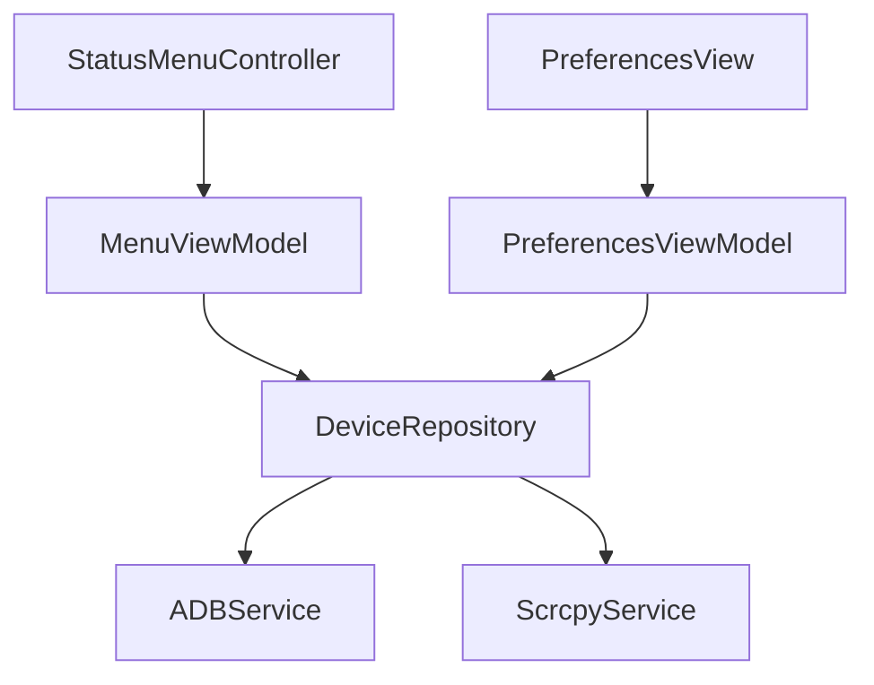

# AndroLaunch - Android Device Management Suite

<p align="center">
  
</p>

<p align="center">
  
  
  
  
  

</p>


A professional macOS menu bar application for managing Android devices through ADB and Scrcpy, built with modern Swift architecture patterns.

## Features ✨

- **Device Management**:
  - List connected Android devices
  - Refresh device list in real-time
  - Display device status (connected/unauthorized)
- **Quick Actions**:
  - Toggle WiFi, Bluetooth, Mobile Data, Airplane Mode
  - Toggle Location, Do Not Disturb, Auto-Rotate
  - Control Sound Mode and Adaptive Brightness
  - Reboot device (System/Bootloader/Recovery)
  - Adjust brightness and volume
- **App Management**:
  - Native menu integration for installed apps
  - Search functionality for quick access
  - Launch apps directly from menu
  - **New**: Uninstall apps with confirmation
  - **New**: Clear app data
  - **New**: Install APKs directly from file
- **Device Mirroring**:
  - Full device screen mirroring via Scrcpy
  - **New**: Borderless window mode
  - **New**: Camera mirroring with custom settings (Facing, FPS, Resolution)
  - Launch apps in dedicated windows
  - Custom display resolutions
  - **New**: Audio toggle and low latency buffering
- **Clipboard Sync**:
  - **New**: Bi-directional clipboard synchronization (Mac ↔ Android)
  - Requires [AdbClipboard](https://play.google.com/store/apps/details?id=ch.pete.adbclipboard) installed on the Android device for Android → Mac sync.
- **ADB Management**:
  - Automatic ADB path discovery
  - **New**: Open ADB Shell terminal
  - **New**: Wireless pairing with QR code
  - Daemon management
  - Error handling and recovery
- **Preferences**:
  - ADB status monitoring
  - Error display and recovery guidance

## Architecture 🏛️

The project follows Clean Architecture principles with the following layers:

### Core Layer

- **Services**: Core services like ADB service, device management
- **DI**: Dependency injection container
- **Constants**: App-wide constants and configurations

### Data Layer

- **Repositories**: Implementation of repository interfaces
- **Parsers**: Data parsing and transformation
- **Services**: Data-related services

### Domain Layer

- **Models**: Business models and entities
- **UseCases**: Business logic and use cases
- **Repositories**: Repository interfaces

### Presentation Layer

- **MenuBar**: Menu bar UI components
- **Preferences**: Settings and preferences UI

## Key Components 🔑

### Service Layer

| Service           | Protocol                | Implementation  | Description                                         |
| ----------------- | ----------------------- | --------------- | --------------------------------------------------- |
| ADB Manager       | `ADBServiceProtocol`    | `ADBService`    | Handles all ADB operations and device communication |
| Scrcpy Controller | `ScrcpyServiceProtocol` | `ScrcpyService` | Manages device mirroring and app launching          |

### Repository Pattern

```swift
protocol DeviceRepositoryProtocol {
    func refreshDevices()
    func fetchApps(for deviceID: String)
    func launchApp(packageID: String, deviceID: String)
    func mirrorDevice(deviceID: String)
}
```

### ViewModel Structure



## Data Flow 🔄

1. **User Action** (e.g., Refresh Devices)
2. **ViewModel** receives action
3. **Repository** coordinates services
4. **Service** executes platform-specific operations
5. **Combine Publishers** propagate changes back
6. **UI** updates automatically

## Setup

### Running the Release Build

To run the release build of AndroLaunch, you must have `adb` and `scrcpy` installed on your system, as the app relies on them for device communication and mirroring.

1. **Install Dependencies**:

   ```bash
   brew install android-platform-tools scrcpy
   ```

2. **Launch the App**:
   - Ensure the app has permissions to access the local network (for wireless debugging) and screen recording (if required by macOS for certain features, though usually not needed for ADB).

### Development Setup

1. Clone the repository
2. Install dependencies:
   ```bash
   brew install android-platform-tools
   ```
3. Open `AndroLaunch.xcodeproj` in Xcode
4. Build and run the project

## Development

### Prerequisites

- Xcode 15.0+
- macOS 13.0+
- Android SDK
- ADB (Android Debug Bridge)

### Building

1. Open the project in Xcode
2. Select your target device
3. Build and run (⌘R)

### Testing

- Unit tests are located in the `Tests` directory
- UI tests are located in the `UITests` directory

## Contributing 🤝

1. Fork the repository
2. Create feature branch (`git checkout -b feature/amazing-feature`)
3. Commit changes
4. Push to branch
5. Open Pull Request

## License 📄

This project is licensed under the MIT License.

---

**Powered By**:
[](https://github.com/Genymobile/scrcpy)
